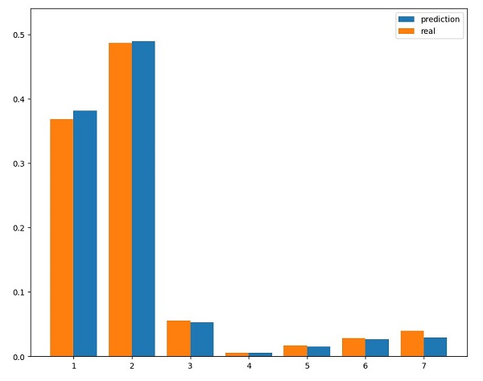

Covertype [dataset](https://archive.ics.uci.edu/dataset/31/covertype): classification of pixels into 7 forest cover types based on attributes such as elevation, aspect, slope, hillshade, soil-type, and more. Preprocessed dataset with renamed columns for the ease of use is [here](dataset/README.md)

# Description

KNN classifier with GridSearch from sklearn is used. TWe achieved cross-validaion accuracy of 0.766 and the test accuracy of 0.785. One possible explanation of the higher test accuracy is that the classifier with best parameters found  with grid search, aftewards, is fitted to the whole train set without splitting data for validation set. 

